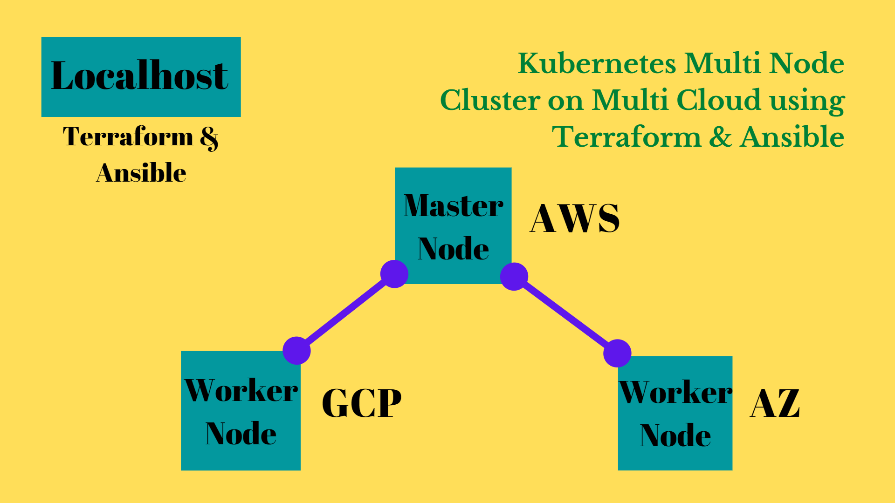

### This project is an integration of different tools & technologies like AWS, Azure, GCP, Kubernetes, Terraform, Ansible etc.
#### To see the practical demonstration follow the link : https://youtu.be/UnBJXxEVeJQ
#### Project Description :
##### Setting up Multi Node Kubernetes cluster on Multi Cloud. Here we are setting up total 3 instances across all three cloud. On AWS we are setting up Kubernetes Master Node. On GCP & Azure we are setting up Kubernetes Worker Node. Refer to the below diagram to understand the infrastructure.

